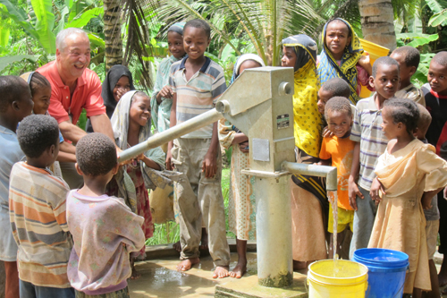
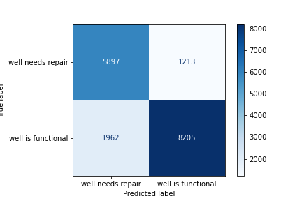
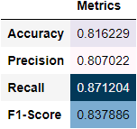

# TanzanianWaterWells

**Authors**: Moses Kuria

## Overview

WaterAid is an international NGO focused exclusively on ensuring equitable access to safe water, sanitation and hygiene education (WASH) for the world’s poorest communities. Tanzania, as a developing country, struggles with providing clean water to its population of over 57,000,000. There are many water points already established in the country, but some are in need of repair while others have failed altogether. To help them achieve their goal of improving access to water supplies, I have been tasked with exploring data from 59,400 wells that were previously recorded to locate wells needing repair and find patterns in non-functional wells to influence how new wells are built and how the existing wells are repaired. 

## Business Problem

Tanzania is a developing country and much of it does not have access to piped water. To solve the challenge of supplying clean water for their daily needs, wells have been dug throughout the country in rural areas. Water is obtained from these wells through various means such as handpumps, some naturally allow water to flow due to the influence of gravity and so on. To ensure a constant supply of water, the status of the functionality of these wells must be monitored and also predicted. WaterAid wants to be able to predict the status of functionality of a well in order to repair the wells and ensure access to clean water for all. This will, in turn, save numerous lives and also promote the quality of life for all those who depend on the various wells.

To achieve this, I will look at a dataset with information on 59,400 wells to be able to predict the functionality of a well given the features in this dataset. This will be achieved by building a model that will best describe the data and give me accurate and precise predictions.

## Data Understanding

The dataset used was obtained from https://www.drivendata.org/competitions. It contains 59400 rows and 40 features some of which are similar in nature. After importing the necessary packages, I loaded the dataset into pandas dataframes. The target variable and the training values were in different CSV files. I then proceeded to merge the two pandas dataframes to be able to work on a single dataframe. 

Since my aim was to turn this into a binary classification problem, I chose to divide the problem into wells that need repair, and those that do not. This is because a binary classification problem will allow me to use modeling to make predictions. There were some wells that were functional but still needed repair, however, since our goal is to ensure all the wells are in proper working condition, this will fit the data very well. I also explored the missing values and the duplicates. 

## Modeling

I chose to build models to solve the particular problem at hand. The goal was to achieve prediction of needing repair or not needing repair data on wells to work with. Exploratory data analysis will tell me the current state of the wells. Modeling will enable me to predict their status given certain features to work with.

The goal is to start easy and work my way to harder and more complex models. I aim to build 4 models and their hyperparameter tuned counterparts. These are:
1. DecisionTreeClassifier
2. LogisticRegressor
3. RandomForestClassifier
4. K-Nearest Neighbors(KNN)

The models suit this problem well because they are classifiers, and this is a classification problem. Some of them double as regressors, however, I will only focus on their classification element.

Starting with our baseline accuracy,I can improve from there. If each of our models predicted every well to be functional, meaning it does not need repair, it would be 54% accurate. From there, we can compare the final accuracy numbers to see how each model performs.

Accuracy will be the main metric used to evaluate these models. This is because we want the model to be able to correctly classify the wells above all else. The rest of the metrics will be used as support metrics.

## Evaluation

I ran a total of 9 models, the baseline models and their hyperparameter tuned versions. The performance of the models varied with some overfitting on the training data and some not performing as well as expected. Notably, the performance of the logistic regressor reduced when I hyperparameter tuned the model. I attribute this to not having a wide enough search space for the best parameters. This can be improved upon in other iterations of the model. 

These were how the models performed in terms of accuracy:

1. RandomForestClassifier - 0.816 (81.6%)
2. BaggingClassifier with RandomForestClassifier - 0.815 (81.5%)
3. DecisionTreeClassifier - 0.78 (78.3%)
4. LogisticRegression - 0.728 (72.8%)
5. KNN - 0.717 (71.7%)

The best performing model was RandomForestClassifier. The model fits THE data well with these being the other evaluation metrics:

1. Precision score - 0.807 (80.7%)
2. Recall - 0.871 (87.1%)
3. F1 score - 0.837 (83.7%)

I am confident that the model would generalize beyond the current data due to the high scores on the test data. This indicates that the model is able to learn and predict properly. The model also performed well due to the data we put into it. Good input data generates good outputs. 

The model would serve WaterAid well in its pursuit to know which wells need repair and make a real impact on the people of Tanzania.

## Conclusion

My final model that performed best was a RandomForestClassifier. It had an accuracy = 0.816, precision score = 0.807, Recall = 0.871 and an F1 score = 0.837.
​
Based on the results of this work, I would recommend WaterAid to ... . 
​
WaterAid should also gather more data on the features used to build the model as well as more relevant details such as Consumption of water to be able to make the model better. 
​
The analysis, though comprehensive, might not fully solve the problem at hand. One of the constraints I suffered was time. Given more time, better models could have been built. I was also limited by the machine I used. Some of the techniques like hyperparameter tuning are computationally expensive. They have long run-times and hence, limitation on how these techniques are used is required. 
​
In future, the model can be improved by engineering new features that might be more relevant to the problem at hand. More robust techniques can also be used to clean the data, as well as collection of actual data to avoid imputation. More computation power can be added to effectively make use of hyperparameter tuning with GridSearchCV.

## For More Information

Please review our full analysis in [our Jupyter Notebook](./TanzanianWaterWells.ipynb) or our [presentation](./TanzaniaWaterWells%20Presentation.pdf).

For any additional questions, please contact **Moses Kuria & moses.kuria@student.moringaschool.com**

## Repository structure
├── data                           
├── images                     
├── README.md  
├── TanzaniaWaterWells.ipynb              
├── TanzaniaWaterWells_Presentation.pdf	

